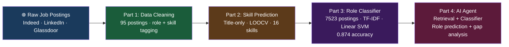

# 📊 Job Market Analysis — Data Science Career Pipeline

> A 4-part end-to-end data science series: from raw job postings to an AI agent that predicts roles and gaps — built by a Data Science student analysing the exact market she's entering.

## 🌐 Read the full series on Medium

| Part | Article | What it answers |
|------|---------|----------------|
| 1 | [📄 What 95 Real Job Postings Reveal](https://medium.com/@sadhvikasunkara4/i-built-a-data-pipeline-to-analyze-the-job-market-im-trying-to-enter-part-1-what-95-real-job-f6d8754fc7d6) | What does the real job market actually look like? |
| 2 | [🔍 Can a Job Title Predict Required Skills?](https://medium.com/@sadhvikasunkara4/i-built-a-data-pipeline-to-analyze-the-job-market-im-trying-to-enter-part-2-can-a-job-title-841a9585ec62) | Title-only signal — how far can it go? |
| 3 | [🤖 Building an ML Role Classifier](https://medium.com/@sadhvikasunkara4/building-a-model-to-predict-what-skills-you-actually-need-part-3-the-ml-9baf05bca00f) | Can ML classify DA vs DS vs DE vs AI from job text? |
| 4 | [🧠 I Built an AI Agent That Tells You Exactly What to Learn](https://medium.com/@sadhvikasunkara4/i-built-an-ai-agent-that-tells-you-exactly-what-to-learn-to-get-hired-part-4-the-agent-73c487b242ac) | Can the classifier + retrieval tell someone what to learn? |

---

## 🏗️ Architecture



---

## 📊 Key results

| Metric | Result |
|--------|--------|
| Dataset size | 7,523 real job postings |
| Sources | Indeed · LinkedIn · Glassdoor |
| Model | Linear SVM + TF-IDF |
| Accuracy | **0.874** on held-out test set |
| Classes | Data Analyst · Data Scientist · Data Engineer · AI Engineer |
| Honest limitation | `min_df=5` drops rare terms like "langchain" (appears in only 4 docs) |

---

## 📁 Repo structure

```
job-market-analysis/
├── part1_dataset_cleaning/   ← Raw scrape → cleaned, role/skill-tagged (95 rows)
├── part2_skill_prediction/   ← Per-skill title-only classifiers, LOOCV (16 skills)
├── part3_role_classifier/    ← 4-class role classifier on full text (7,523 rows)
└── part4_agent/              ← Retrieval + classifier wrapped into a queryable agent
```

Each folder has its own README with the exact question it answers, how to run, and real results.

---

## 🛠️ Tech stack


---

## 💡 Why I built this

I'm a final-year Master of Data Science student at Macquarie University actively job-hunting for DA/DS/DE/AI roles in Sydney. Instead of reading generic career advice, I analysed the actual market I'm entering — cleaned real postings, built classifiers, and wrapped it into an agent that can tell any candidate what role a posting is for and what skills they're missing.

---

## ⚠️ Honest evaluation

This project deliberately reports real numbers and real failures:
- Part 2: Only 4 of 16 skills cleared a meaningful F1 bar at 95 postings
- Part 3: 0.874 accuracy — not 0.99, because real data is messy
- Part 4: The agent misclassifies a live "Senior AI Engineer" posting as Data Engineer due to `min_df=5` dropping "langchain" — documented and explained, not hidden

---

*Built by Sadhvika Sunkara | MDS @ Macquarie University | [LinkedIn](https://linkedin.com/in/sadhvika-sunkara) | [Medium](https://medium.com/@sadhvikasunkara4)*
