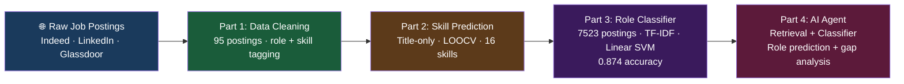

# 📊 Job Market Analysis — Data Science Career Pipeline

> A 4-part end-to-end data science series: from raw job postings to an AI agent that predicts roles and gaps — built by a Data Science student analysing the exact market she's entering.

## 🌐 Read the full series on Medium
| Part | Article | What it answers |
|------|---------|----------------|
| 1 | [📄 What 95 Real Job Postings Reveal](https://medium.com/@sadhvikasunkara4/i-built-a-data-pipeline-to-analyze-the-job-market-im-trying-to-enter-part-1-what-95-real-job-f6d8754fc7d6) | What does the real job market actually look like? |
| 2 | [🔍 Can a Job Title Predict Required Skills?](https://medium.com/@sadhvikasunkara4/i-built-a-data-pipeline-to-analyze-the-job-market-im-trying-to-enter-part-2-can-a-job-title-841a9585ec62) | Title-only signal — how far can it go? |
| 3 | [🤖 Building an ML Role Classifier](https://medium.com/@sadhvikasunkara4/building-a-model-to-predict-what-skills-you-actually-need-part-3-the-ml-9baf05bca00f) | Can ML classify DA vs DS vs DE vs AI from job text? |
| 4 | [🧠 I Built an AI Agent That Tells You Exactly What to Learn](https://medium.com/@sadhvikasunkara4/i-built-an-ai-agent-that-tells-you-exactly-what-to-learn-to-get-hired-part-4-the-agent-73c487b242ac) | Can the classifier + retrieval tell someone what to learn? |

---

## 🏗️ Architecture

---

## 📊 Key results

| Metric | Result |
|--------|--------|
| Dataset size | 7,523 real job postings |
| Sources | Indeed · LinkedIn · Glassdoor |
| Model | Linear SVM + TF-IDF |
| Accuracy | **0.874** on held-out test set |
| Classes | Data Analyst · Data Scientist · Data Engineer · AI Engineer |
| Honest limitation | `min_df=5` drops rare terms like "langchain" (appears in only 4 docs) |

---

## 📁 Repo structure
